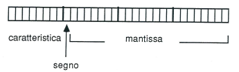
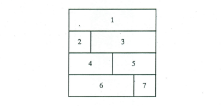
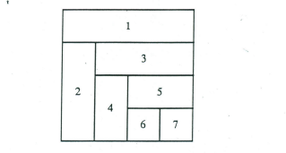
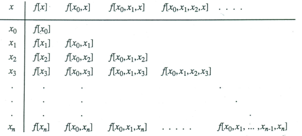

--- 
title : Appunti di Calcolo Numerico 1 
author: Vittorio Romeo 
header-includes: 
    - \usepackage{hyperref} 
    - \usepackage{amsmath}
    - \hypersetup{colorlinks = true}
fontsize: 12pt
---

[http://vittorioromeo.info](http://vittorioromeo.info)

\tableofcontents
\newpage

# Rappresentazione in base

* Vogliamo rappresentare il numero reale $x$.

## Teorema di rappresentazione in base

* Sia $B \geq 2$ un numero intero e $x$ un numero reale non nullo. 

* Allora esistono e sono unici un intero $p$ ed una succesione $\{d_i\}_{i=1,2,...}$ di interi, $0 \leq d_i < B$, $d_1 \neq 0$, non tutti uguali a $B-1$ da un certo indice in poi, tali che:

$$ x = sgn(x) B^p \sum{d_i B^{-i}} $$

* Le quantità $B$, $p$, $d_i$, $\sum{d_i B^{-i}}$ vengono dette:

    * $B$: base della rappresentazione.

    * $p$: caratteristica.

    * $d_i$: cifre della rappresentazione.

    * $\sum{d_i B^{-i}}$: **mantissa**.

* La rappresentazione in base viene indicata con:

$$ x = \pm ( .d_1 d_2 ... ) B^p $$

### Forma normalizzata

* Se $d_1 \neq 0$ e se la mantissa $\in [0, 1]$, la rappresentazione in base é **normalizzata**.

    * La normalizzazione fornisce un'approssimazione migliore.

## Range rappresentabile

* Siano $B$, $t$, $m$, $M$, numeri interi tali che $B \geq 2$, $t \geq 1$, $m > 0$, $M > 0$.

* Si definisce l'insieme dei **numeri di macchina** in base $B$ con $t$ cifre significative l'insieme:

$$ F(B, t, m, M) = \{0\} \cup $$
$$ \{ x \in R: x = sgn(x) B^p \sum_{i=1}^{t} d_i B^{-i}, 0 \leq d_i < B, i = 1, 2, ..., t, d_1 \neq 0, -m \leq p \leq M \} $$

* Dato che lo zero non è rappresentabile, deve essere aggiunto esplicitamente.
    
    * Lo zero viene rappresentato con mantissa nulla e caratteristica $p = -m$.

* Un numero di macchina $x \neq 0$ viene denotato con:

$$ x = \pm ( .d_1 d_2 ... d_t ) B^p $$

* Se $x$ non appartiene a $F(B,t,m,M)$, si pone il problema di associare un $x'$ adeguato a $x$. Si presentano due casi:

    * $p \notin [-m, M]$: overflow ed underflow.

    * $p \in [-m, M], p \notin F$: troncamento ed arrotondamento.

### Overflow e underflow

* L'**overflow** si verifica quando $p > M$.

    * In tal caso, $x$ non è definita. *(`NaN`)*

* L'**underflow** si verifica quando $p < -m$.

    * In tal caso, $x$ è uguale a zero.

### Troncamento ed arrotondamento

* *Troncamento di $x$ alla $t$-esima cifra*: $x' = trn(x) = B^p \sum_{i=1}^{t} d_i B^{-i}$.

* *Arrotondamento di $x$ alla $t$-esima cifra*: $x' = arr(x) = B^p trn(\sum_{i=1}^{t+1} d_i B^{-i} + \frac{1}{2} B^{-t})$. 

    * Può verificarsi **overflow**.

### Errori

#### Definizioni

* La quantità $u$, è detta **precisione di macchina**.

* L'errore $x' - x$ è detto **errore di rappresentazione**.

### Errore assoluto e relativo

* Errore commesso nel rappresentare $x \neq 0$:

    * $x' - x$: errore assoluto.

    * $\frac{x' - x}{x}$: errore relativo.

### Precisione di macchina

* Condizioni:

    * Non si presenta overflow.

    * $x = B^p \sum_{i=1}^{\infty} d_i B^{-i}$.

* Maggiorazione errore relativo:

    * $u > | \frac{x' - x}{x} |$.
    
    * $u > | \frac{x' - x}{x'} |$.

* Quantità $u$:

    * Se $x' = trn(x)$, $u = B^{1-t}$.

    * Se $x' = arr(x)$, $u = \frac{1}{2} B^{1-t}$.

## Amplificazione degli errori

* Avendo $x_1, x_2, ..., x_n$, volendo calcolare $y_1, y_2, ..., y_n$ tramite $f(x), f: D \rightarrow R^n$, ci sono due tipi di errori.

### Errore inerente

* Causato dal condizionamento delle $x$.

* $x_p = x$ perturbate, $x_r = x$ reali.

* Errori $\varepsilon x$ e $\varepsilon y$.

    * $\varepsilon x = \frac{x_p - x_r}{x_r}$.

    * $\varepsilon y = \frac{|f(x_p)| - |f(x_r)|}{|f(x_r)|}$.

    * Se $\varepsilon x >> \varepsilon y$ allora **i dati sono malcondizionati**.

### Errore aritmetico

* Riguarda le operazioni $+$, $-$, $*$, $/$.

* Definiamo $x = x(1+\varepsilon x)$ e $y = y(1+\varepsilon y)$.

* Moltiplicazione:
    
    *   $xy = x(1+\varepsilon x) y(1+\varepsilon y)$.

        $xy \simeq 1 + \varepsilon x + \varepsilon y$.

* Divisione: 

    * $x/y \simeq 1 + \varepsilon x - \varepsilon y$.

* Somma:

    * $x + y \simeq (x+y) (1 + \frac{x \varepsilon x}{x+y} + \frac{y \varepsilon y}{x+y})$.

* Sottrazione:

    * $x - y \simeq (x-y) (1 + \frac{x \varepsilon x}{x+y} - \frac{y \varepsilon y}{x+y})$.

# Norme

* *"Misura della grandezza"* di una matrice o vettore.

## Norme vettoriali

* $|| . ||: \mathbb{C}^n \rightarrow \mathbb{R}$.

### Tre proprietà

1. $||x|| > 0$ per $\forall x \in \mathbb{C}^n$, $||x|| = 0$ solo per $x = 0$.

2. $||\alpha x|| = |\alpha| ||x||$ per $\alpha \in \mathbb{R}, \alpha \neq 0$.

3. $||x+y|| \leq ||x|| + ||y||$. *(Disuguaglianza triangolare.)*

### Formule

* $||x||_1 = \sum_{i=1}^{n} |x_i|$.

* $||x||_2 = \sqrt{x^T x} = \sqrt{\sum_{i=1}^{n}(x_i)^2}$.

* $||x||_\infty = {max}_{i=1}^{n} |x_i|$.

### Equivalenza topologica

* $\forall ||.||_*, ||.||_{**} \exists \alpha, \beta \in \mathbb{R}, 0 \leq \alpha \leq \beta : \forall x \in \mathbb{C}^n$ allora $\alpha ||x||_* \leq ||x||_{**} \leq \beta ||x||_*$.

    * Le norme **si limitano a vicenda**.

## Norme matriciali

* $|| . ||: \mathbb{C}^{n \times m} \rightarrow \mathbb{R}$.

### Quattro proprietà

1. $||A|| > 0$ per $\forall A \in \mathbb{C}^{n \times m}$, $||A|| = 0$ solo per $A = 0$.

2. $||\alpha A|| = |\alpha| ||A||$ per $\alpha \in \mathbb{R}, \alpha \neq 0$.

3. $||A+B|| \leq ||A|| + ||B||$.

4. $||AB|| \leq ||A|| ||B||$.

### Norma indotta

* Dato che la norma vettoriale **è una funzione continua**...

    * ...allora $\{x \in \mathbb{R}^n : ||x|| = 0\}$ è **un insieme chiuso**.

        * *Insieme chiuso: il bordo dell'insieme appartiene all'insieme stesso.*

* Dato che $\exists \alpha : ||x||_\infty \leq \alpha ||x||$ *(per l'equivalenza topologica)*...

    * ...cioè ${max}_{i=1,...,n} |x_i| \leq \alpha$...

    * ...allora l'insieme **è anche limitato**.

* In un insieme **chiuso e limitato** è possibile trovare un minimo ed un massimo.

    * Quindi $\exists {max}_{||x|| = 1} ||A x||$.

* Dato $A \in \mathbb{R}^{n \times n}, x \in \mathbb{R}^n$ e data una norma $||.||$...

    * ...allora $\exists ||A|| = {max}_{||x||=1} ||Ax||$ ed è detta **norma indotta**.

### Formule

* $||A||_1 = {max}_{j \in [1, n]} \sum_{i=1}^{n} |a_{ij}|$.

* $||A||_2 = \sqrt{\rho (A^T A)}$. *(Calcolo molto oneroso.)*

* $||A||_F = \sqrt{\sum_{i=1}^{n}(\sum_{j=1}^{n}(a_{ij})^2)}$. *(Approssima la norma 2.)*

* $||A||_\infty = {max}_{i \in [1, n]} \sum_{j=1}^{n} |a_{ij}|$.

# Sistemi lineari

* $Ax = b$, $A \in \mathbb{R}^{m \times n}$.

$$
\begin{bmatrix}
    a_{11} x_1 & a_{12} x_2 & \dots  & a_{1n} x_n \\
    a_{21} x_1 & a_{22} x_2 & \dots  & a_{2n} x_n \\
    \vdots & \vdots & \ddots & \vdots \\
    a_{m1} x_1 & a_{m2} x_2 & \dots  & a_{mn} x_n
\end{bmatrix}
=
\begin{bmatrix}
    b_1 \\
    b_2 \\
    \vdots \\
    b_n
\end{bmatrix}
$$

## Relazione tra rango e soluzioni

* Se $r(A) \neq r(A|b)$ $\rightarrow$ non ci sono soluzioni.

* Se $r(A) = r(A|b)$ $\rightarrow$...

    * ...e $n = r$ $\rightarrow$ una sola soluzione.

    * ...e $n > r$ $\rightarrow$ $\infty^{(n-r)}$ soluzioni.

    * *(Teorema di Rouche-Capelli.)*

## Metodi di risoluzione

### Metodi diretti

* Risolvono i sistemi tramite una **fattorizzazione LU** e la **backward/forward substitution**.

* Metodi per la fattorizzazione LU:
    
    * Metodo di **Gauss**, metodo di **Cholesky**.

### Metodi indiretti

* Risolvono i sistemi partendo da un $x$ arbitraria, avvicinandosi alla soluzione reale con ogni iterazione.

    * Metodo di **Jacobi**, metodo di **Gauss-Seidel**.

## Condizionamento

1. Perturbiamo $b$, ottenendo $\delta b$. Avremo quindi una perturbazione $\delta x$.

2. Da $Ax = b$, otteniamo $A(x+\delta x) = b + \delta b$.

3. $Ax + A \delta x = b + \delta b$.

4. $Ax = b$, quindi $A \delta x = \delta b$.

5. Esplicitiamo $\delta x$: $\delta x = A^{-1} \delta b$.

6. (@cond_0) Applichiamo la norma ed una delle sue proprietà: $||\delta x|| = ||A^{-1} \delta b|| \leq ||A^{-1}|| ||\delta b||$.

7. (@cond_1) Applichiamo la norma a $Ax = b$: $||b|| = ||Ax|| \leq ||A|| ||x||$.

8. Mettiamo in relazione @cond_0 e @cond_1: $\frac{||\delta x||}{||x||} \leq ||A|| ||A^{-1}|| \frac{||\delta b||}{||b||}$.

* $\frac{||\delta x||}{||x||} = \varepsilon x$ è la **perturbazione indotta sul vettore $x$**.

* $\frac{||\delta b||}{||b||} = \varepsilon b$ è la **perturbazione di $b$**.

* $||A|| ||A^{-1}|| = \mu (A)$ è detto **indice di condizionamento**.

* Quindi: $\varepsilon x \leq \mu (A) \varepsilon b$.

# Fattorizzazione LU

* Con $A = \mathbb{R}^{n \times n}$, vogliamo $A = LU$.

    * $L$ è una matrice **triangolare inferiore** - i valori sulla diagonale sono tutti $1$.

    * $U$ è una matrice **triangolare superiore** - i valori sulla diagonale sono $\neq 0$.

## Stabilità

* Un algoritmo per la fattorizzazione LU si dice **stabile** se: $\exists \alpha, \beta$ *(indipendenti da $n$, $a_{ij}$)* $: |l_{ij}| < \alpha \wedge |u_{ij}| < \beta$.

## Formula generale

* $a_{ij} = \sum_{k=1}^{min(i,j)} l_{ik} u_{kj}$.

## Metodo compatto

* Procedendo per righe, si ha:

(@r0) $$a_{ij} = \sum_{k=1}^{i-1} l_{ik} u_{kj} + u_{ij}, (j = i,...,n), (i=1,...,n)$$

(@r1) $$a_{ij} = \sum_{k=1}^{j-1} l_{ik} u_{kj} + l_{ij} u_{jj}, (j = 1,...,i-1), (i=2,...,n)$$

* Dalle (@r0) e (@r1) si ha:

(@r2) $$u_{ij} = a_{ij} - \sum_{k=1}^{i-1} l_{ik} u_{kj}, (j = i,...,n), (i=1,...,n)$$

(@r3) $$l_{ij} = \frac{1}{u_{jj}} [ a_{ij} - \sum_{k=1}^{j-1} l_{ik} u_{kj} ], (j = 1,...,i-1), (i=2,...,n)$$

* Il calcolo procede così:

    * Per $i=1$, dalla (@r2) si ha $u_{1j} = a_{1j}, (j=1,...,n)$;

    * Per $i=2$, dalla (@r3) si ha $l_{21} = a_{21}/u_{11}$ e dalla (@r2) $u_{2j} = a_{2j} - l_{21} u_{1j}, (j = 2,...,n)$;

    * Per $i=n$, dalla (@r3) si possono calcolare gli $l_{n1}, (j=1,...,n-1)$, utilizzando gli $l_{nk}, (k<j)$ della stessa riga già calcolati e gli $u_{kj}$ calcolati precedentemente. Dala (@r2) si può calcolare $u_{nn}$.

{ width=50% }

{ width=50% }

## Metodo di Cholesky

* Complessità: $n^3/6 = O(n^3)$.

* Ci fornisce la matrice $L$.

* Funziona solo se:

    * $A$ è quadrata.

    * $A$ è simmetrica.

    * $A$ è definita positiva.

        * Una matrice è **definita positiva** quando soddisfa il **criterio di Sylvester**: tutte le sottomatrici quadrate superiori sinistre hanno determinante positivo *(i minori principali secondo l'ordine da $1$ a $n$)*.

### Procedimento

1. Dato che $A$ è simmetrica, $D D^{-1} = I$.

2. $ A = LU = LIU = LD D^{-1} U$.

3. Definiamo $D^{-1} U = Y$. Quindi, $A = LDY$.

4. Dato che $A$ è simmetrica, $L^T = Y$ e $L = Y^T$.

5. $L^T = Y = D^{-1} U$. Esplicitiamo $U$: $U = D L^T$. 

6. $A = LU$ $\rightarrow$ $A = L L^T$.

### Formule

$$ l_{jj} = \sqrt{a_{jj} - \sum_{k=1}^{j-1}(l_{jk})^2} $$

$$ l_{ij} = \frac{1}{l_{jj}} ( a_{ij} - \sum_{k=1}^{j-1} l_{ik} l_{jk} ) $$

## Metodo di eliminazione di Gauss

* Complessità: $n^3/3 = O(n^3)$.

* Ci fornisce la matrice $U$.

### Tre operazioni

1. **Scambio di righe**.

2. **Operazioni elementari** sulle equazioni.

3. **Combinazione lineare**. *(Somma riga a multiplo di altra riga.)*

### Algorithmo

1. Portare alla prima riga quella che ha il minor numero di zeri.

2. Far diventare zero gli elementi delle colonne sottostanti il primo elemento $\neq 0$ della riga precedente *(pivot)*.

3. Continuare finchè non si ottiene una matrice **a scalini**.

### Formule

* Con $k \in [1, n]$ e $i \in [k+1, n]$.

* Fattore di annullamento: $m_{ik} = \frac{ a_{ik}^{(k)} }{ a_{kk}^{(k)} }$.

$$ a_{ij}^{(k+1)} =  \begin{cases} a_{ij}^{(k)}, & \mbox{se } i \leq k \\ 
                                   a_{ij}^{(k)} - m_{ik} a_{kj}^{(k)}, & \mbox{se } i > k \end{cases} $$

$$ b_i^{(k+1)} =   \begin{cases} b_i^{(k)}, & \mbox{se } i \leq k \\ 
                                   b_i^{(k)} - m_{ik} b_k^{(k)}, & \mbox{se } i > k \end{cases} $$

### Metodo di Gauss-Jordan

* Complessità: $2/3 n^3 = O(n^3)$.

* Serve a calcolare $A^{-1}$.

#### Algoritmo

1. Orlare $A$ con $I$.

2. Usare le operazioni di Gauss **per annullare la sottodiagonale** di $A$.

3. Annulliamo la sopradiagonale di $A$.

4. Dividiamo ogni riga per il pivot *(valore della diagonale principale)*.

5. Avremo a sinistra $I$ ed a destra $E = A^{-1}$.

#### Gauss con perno massimo

* Per ogni riga, prende sempre il **valore massimo**.

* La stabilità comporta che $\beta = 2^{n-1} {max}_{i,j \in [1, n]} |a_{ij}|$. Dato che questa formula dipende da $n$, questa versione di Gauss è **stabile in senso debole**.

# Forward/backward substitution

* Dopo aver scomposto una matrice in $LU$, per risolvere il sistema lineare ed ottenere $x$ dobbiamo applicare la **forward** *(nel caso della $L$)* o **backward** *(nel caso della $U$)* substitution.

## Formule

* *L'unica cosa che varia tra le due formule è l'indice della sommatoria.*

### Forward substitution

$$ x_i = \frac{1}{a_{ii}} (b_i - \sum_{j=1}^{i-1}(a_{ij}x_j)) $$

### Backward substitution

$$ x_i = \frac{1}{a_{ii}} (b_i - \sum_{j=i+1}^{n}(a_{ij}x_j)) $$

# Risoluzione sistemi tridiagonali

* $Ax = b$.

* I sistemi tridiagonali possono essere risolti più rapidamente.

* Il vettore $b$ è la diagonale principale. I vettori $a$ e $c$ lo circondano.

$$
\begin{bmatrix}
    b_1 & c_1 &   0 &   0 &   0 \\
    a_1 & b_2 & c_2 &   0 &   0 \\
    0   & a_2 & b_3 & c_3 &   0 \\
    0   &   0 & a_3 & b_4 & c_4 \\
    0   &   0 &   0 & a_4 & b_5 
\end{bmatrix}
=
\begin{bmatrix}
    d_1 \\
    d_2 \\
    d_3 \\
    d_4 \\
    d_5
\end{bmatrix}
$$

## Procedimento

* Definiamo $p$ come vettore della **diagonale temporanea**.

* Definiamo $s$ come vettore della **soluzione temporanea**.

* Con $p_1 = b_1$, $s_1=d_1$, e $i=2,...,n$.

* Utilizziamo una specializzazione del metodo di Gauss:

    * $m_{ik} = q = a_i / p_{i-1}$.

    * $p_i = b_i - q c_i$.

    * $s_i = d_i - q s_{i-1}$.

* Terminiamo con la **backward substitution**:

    * $x_i = (s_i - c_i x_{i+1}) / p_i$.

# Metodi iterativi

* Dato $Ax = b$, esprimiamo $A = M - N$ con $det M \neq 0$. Quindi, $(M-N) x = b$.

* Esplicitiamo $x$: $x = M^{-1}(Nx + b) = M^{-1} Nx + M^{-1} b$.

## Tecnica iterativa generale

* Si comincia con un $x^{(0)}$ arbitrario. *(Stima iniziale.)*

* $x^{(k)} = M^{-1} Nx^{(k-1)} + M^{-1}b$.

* Definiamo la **matrice di iterazione** $T = M^{-1} N$.

    * $x^{(k)} = Tx^{(k-1)} + M^{-1}b$.

## Teorema convergenza metodo iterativo

### Ipotesi

* Dati $A=M-N$, $P=M^{-1} N$, e $||P|| < 1$.

* $\lim_{k\to\infty} x^k = x^*$.

    * Dove $x^*$ è la soluzione *esatta*.

### Dimostrazione

1. $Ax=b$, $A=M-n$,$P=M^{-1} N$, e $Q= M^{-1} b$.

2. Esplicitiamo $x$: $x = M^{-1}(Nx + b) = M^{-1} Nx + M^{-1} b$.

3. Sostituiamo con $P$ e $Q$: $x= Px + Q$. 

4. (@dim_itr_0) Usiamo la tecnica iterativa: $ x^{(k)} = Px^{(k-1)} + Q$.

5. Se *(per ipotesi)* $\lim_{k\to\infty} x^k = x^*$, allora (@dim_itr_1) $ x^* = Px^* + Q$.

6. Definiamo l'errore $e^{(k)} = x^* - x^{(k)}$.

7. Mettiamo l'errore in relazione con @dim_itr_0 e @dim_itr_1: $e^{(k)} = x^* - x^{(k)} = P(x^* - x^{(k)})$.

8. $e^{(k)} =  P^1(e^{(k-1)})$.

9. In generale: $e^{(k)} =  P^k(e^{(0)}) = P^1(e^{(k-1)}) = P^2(e^{(k-2)}) = ...$.

10. Applichiamo la norma: $||e^{(k)}|| =  ||P^k(e^{(0)})|| \leq ||P^k|| || e^{(0)}||$ *(per ipotesi $||P|| < 1$)*.

11. Dato che $e$ e $P$ sono in relazione, analizziamo i limiti. Se $\lim_{k\to\infty} ||P||^k = 0$, allora $\lim_{k\to\infty} ||e^{(k)}|| = 0$, allora $\lim_{k\to\infty} e^k = 0$.

12. Se $\lim_{k\to\infty} e^k = 0$, allora l'errore converge a 0.

## Condizione necessaria e sufficiente di convergenza

* Se $A$ è diagonale strettamente dominante *(tutti gli elementi sulla diagonale sono maggiori di quella sulla riga)*, allora **sia Gauss-Seidel che Jacobi convergono**.

* Se $A$ è definita positiva, **Gauss-Seidel converge** - su Jacobi non si può dire nulla.

## Metodo di Jacobi

* Complessità: $2n^2 = O(n^2)$.

* $A=M-N$, $M=D$, $N=-(E+F)$, $A=D+E+F$.

* $x^{(k)} = M^{-1} Nx^{(k-1)} + M^{-1} b$.

* $x^{(k)} = -D^{-1} (E-F)x^{(k-1)} + D^{-1} b$. 

    * $-D^{-1} (E+F)$ è detta matrice di iterazione $T_j$.

* $x_i^{(k)} = \frac{1}{a_{ii}} (\sum_{j=1, j \neq i}^{n} - a_{ij} x_j^{(k-1)} + b_i)$.

## Metodo di Gauss-Seidel

* Complessità: $2n^2 = O(n^2)$. Usa meno memoria del metodo di Jacobi *(conserva solo la metà delle soluzioni precedenti)*.

* $A=M-N$, $M=E+D$, $N=-F$.

* $x^{(k)} = -(E+D)^{-1} Fx^{(k-1)} + (E+D)^{-1} b)$.

    * Dove $-(E+D)^{-1} F$ è la matrice di iterazione.

* $x^{(k)} = \frac{1}{a_{ii}}(\sum_{j=1}^{i-1} a_{ij} x_j^{(k)} - \sum_{j=i+1}^{n} a_{ij}^{(k-1)} + b_i)$ 

## Criteri di arresto

* Due possibili scelte, fissato un valore $\varepsilon$.

    1. $||x^{(k)} - x^{(k-1)}|| \leq \varepsilon$.

    2. $\frac{||x^{(k)} - x^{(k-1)}||}{||x^{(k)}||} \leq \varepsilon$.

# Interpolazione

* Data una funzione $f(x)$ ed $n$ nodi o *punti base* $f(x_1) = y_1, f(x_2) = y_2, ..., f(x_n) = y_n$, vogliamo approssimare $f$ con $g$.

* Fissiamo uno spazio di infinite funzioni appartenenti alla classe $n+1$, definite dalla seguente base:

    * $\Phi_j(x)$, $j=0, ..., n$.

    * Tali funzioni sono definite su $[a, b]$ e sono **linearmente indipendenti**.

* Formula generatrice dello spazio di funzioni:

    * $\sum_{j=0}^{n} c_j \Phi_j(x)$.

* Bisogna determinare $g(x) = \sum_{j=0}^{n} \alpha_j \Phi_j(x)$, dove $g(x) = f(x), \forall x \in x_1, ..., x_n$.

* Tramite $g$ determineremo un *polinomio di interpolazione** della forma: $p(x) = a_0x^n + a_1x^{(n-1)} + ... + a_{n-1}x + a_n$.

## Interpolazione polinomiale

### Base dei monomi

* $\Phi_j(x) = x^j$.

### Polinomio finale

* $g(x) = \sum_{j=0}^{n} f(x_j) x^j$.

* $P_n(x) = c_0 + c_1 x_1 + c_2 x_2^2 + ... + c_n x_n^n$.

$$
\begin{cases} 
c_0 + c_1 x_1 + c_2 x_1^2 + \dots + c_n x_1^n = y_1 \\ 
c_0 + c_1 x_2 + c_2 x_2^2 + \dots + c_n x_2^n = y_2 \\ 
\vdots \\
c_0 + c_1 x_n + c_2 x_n^2 + \dots + c_n x_n^n = y_n  
\end{cases}
$$

* I coefficienti del sistema lineare ottenuto tramite l'interpolazione polinomiale sono quelli della **matrice di Vandermonde**.

$$
\begin{bmatrix} 
1      & x_1    & x_1^2  & \dots  & x_1^n \\
1      & x_2    & x_2^2  & \dots  & x_2^n \\
\vdots & \vdots & \vdots & \ddots & \vdots \\
1      & x_n    & x_n^2  & \dots  & x_n^n \\
\end{bmatrix}
$$

## Interpolazione di Lagrange

* Ha complessità $O(n^2)$, ma l'aggiunta di un punto comporta la ricalcolazione totale della produttoria.

### Base di Lagrange

* $L_j(x) = \prod_{i=0, i=j}^{n} \frac{x-x_i}{x_j-x_i}$, $j=0,...,n$.

### Polinomio finale

* $P_n(x) = \sum_{j=0}^{n} f(x_j) L_j(x_j)$.

## Interpolazione di Newton

* Ha complessità $O(n^2)$, ma l'aggiunta di un punto comporta poche operazioni in $O(n)$.

### Base delle potenze traslate

* $\pi_n(x) = 1, (x-x_0), (x-x_0)(x-x_1), (x-x_0)...(x-x_{n-1})$.

### Tabella delle differenze divise

* Differenza divisa di ordine $k$. 

    * Per $k = 0$, $f[x_0] = f(x)$.

    * Per $k = 1$, $f[x_0, x] = \frac{f[x] - f[x_0]}{x - x_0}$.

    * Per $k = 2,..., n+1$, $f[x_0, x_1, ..., x_{k-2}, x_{k-1}, x] = \frac{f[x_0, x_1, ..., x_{k-2}, x_{k-1}] - f[x_1, x_2, ..., x_{k-1}, x] }{x-x{k-1}}$.

{ width=50% }

### Polinomio di Newton

* $p(x) = f[x_0] + (x-x_0)f[x_0, x_1] + (x-x_0)(x-x_1)f[x_0, x_1, x_2]$.

## Dimostrazione errori con punti equidistanti

* Definiamo l'errore come $r(x) = f(x) - p(x)$.

    * $r(x_i) = 0, \forall x_i \in x_1,...,x_n$.

### Ipotesi

* Se $f(x)$ è derivabile $n+1$ volte in $[a,b]$, dove $a$ è il minimo $x_i$ e $b$ è il massimo $x_i$...

    * ...allora $r(x) = \pi_n(x) \frac{f^{(n+1)}(\xi)}{(n+1)!}$.

    * Inoltre, $s(x) = \frac{r(x)}{\pi_n(x)}$.

        * $s$ è la superficie.

### Dimostrazione

* Con $a<x<b$ e $x \neq x_i$, definiamo $v(y) = r(y) - s(x) \pi_n(y)$.

    * $v$ è derivabile $n+1$ volte.

    * $v$ si annulla negli $x_n$.

* Allora, $v^{(n+1)}$ si annulla in $\xi$.

* $0 = v^{(n+1)}(\xi) = r^{(n+1)}(\xi) - (n+1)! s(x) = f^{(n+1)}(\xi) - (n+1)! s(x)$.

## Fenomeno di Runge

* Se si verifica un errore molto grande agli estremi dell'intervallo $[a,b]$ *(fenomeno di Runge)* che oscilla tra i punti, esso si può limitare usando due tecniche.

### Nodi di Chebyshev

* Nell'intervallo $[-1, 1]$:

    * $x_i = {cos}(\frac{2_i-1}{2n} \pi)$.

* Nell'intervallo $[a, b]$:

    * $x_i = \frac{a+b}{2} + \frac{b-a}{2} x_i$.

### Interpolazione spline

* Divide gli intervalli in sottointervalli più piccoli con ognuno il suo polinomio interpolatore.

# Integrazione numerica

* Vogliamo approssimare $S= \int_{a}^{b} f(x) dx = F(b) - F(a)$.

## Formule di quadratura

* $S_n = \sum_{i=0}^{n} w_i f(x_i)$.

* $r_n = S - S_n$ *(errore di quadratura)*.

### Tecnica per ricavare formule di quadratura

* $\int_{a}^{b} p(x) dx$.

* $r_n = \int_{a}^{b} f(x) dx - \int_{a}^{b} p(x) dx = \int_{a}^{b} [f(x) - p(x)] dx$.

* Ricaviamo $p(x)$ con Lagrange: $p(x) = \sum_{i=0}^{n} L_i(x) f(x_i) = \sum_{i=0}^{n} L_i(x) y_i =  \sum_{i=0}^{n} ( \int_{a}^{b} L_i(x) dx ) y_i$.

    * Con $w_i$ indichiamo i pesi.

* Se i nodi sono equidistanti, allora $x=x_0 + th$.

    * Definiamo l'incremento con $h$.

#### Metodo di Newton-Cotes

* Per risolvere l'integrale cambiamo variabile. Parliamo di metodo di **Newton-Cotes**.

    * $dx = h dt$, $x_j = x_0 + jh$, $x_i = x_0 + ih$.

    * $\sum_{i=0}^{n} y_i \int_{a}^{b} ( \prod_{j=1, j \neq i}^{n} \frac{x_0+th - x_0 -jh}{x_0 + ih - x_0 - jh} h dt )$.

    * $\sum_{i=0}^{n} y_i h \int_{a}^{b} ( \prod_{j=1, j \neq i}^{n} \frac{t + h}{i - j} dt )$. 

* $S_n = h \sum_{i=0}^{n} \alpha_i f(x_i)$.

    * Dove $\alpha = \prod_{j=1, j \neq i}^{n} \frac{t + h}{i - j} dt$.

### Regola dei Trapezi

* $\int_{a}^{b} f(x) dx = \frac{b-a}{2} (f(a) + f(b))$.

#### Versione composita

* $\int_{a}^{b} f(x) dx = \frac{b-a}{2n} (f(a) + \sum_{i=1}^{2n} f(x_i) + f(b))$.

### Regola di Cavalieri-Simpson

* $\int_{a}^{b} f(x) dx = \frac{b-a}{6} (f(a) + 4 f(\frac{a+b}{2}) + f(b))$.

#### Versione composita

* $\int_{a}^{b} f(x) dx = \frac{b-a}{6n} (f(a) + 4 \sum_{i=1}^{2n, 2} f(x_i) + 2 \sum_{i=2}^{2n - 1, 2} f(b))$.

## Errore quadratura

* $f(x) \in C^S$.

* $r_n = S_n - \int_a^b f(x) dx = \Upsilon_n h^{(s+1)} \frac{f^S(\xi)}{s!}$.

    * Se $n$ è pari, $S = n + 2$ e $\Upsilon_n = \int_0^n t \pi_n(t) dt$.

    * Se $n$ è dispari, $S = n + 1$ e $\Upsilon_n = \int_0^n t \pi_n(t) dt$.

